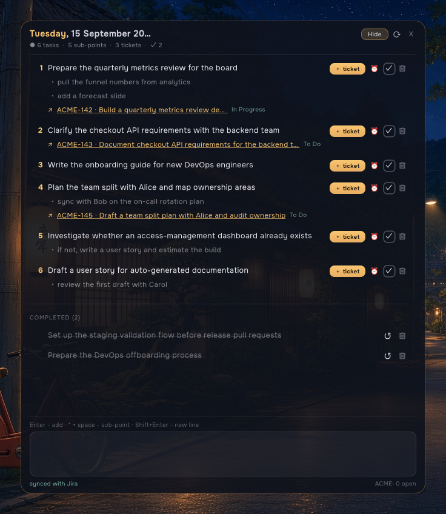

# Desktop Task Panel



A translucent desktop task list you can keep in the corner of your screen.
Type a task, hit **Enter**, and it stays there — no sticky notes, no lost
paper. When a task is ready to become real work, click **＋ ticket** and the
panel drafts an English title + description with an LLM, creates the issue in
Jira, and drops the link back under the task.

It was built to fix one specific problem: task notes that live in sticky notes
get forgotten, and never make it into the tracker. Here the tracker link is one
click away, and the panel shows the live status of every ticket you created.

## What it is

Two Python files and a GTK4 window:

| Piece | What it does |
|---|---|
| `taskpanel.py` | The GTK4 window: task list, multi-line composer, reminders, Jira sync, the ticket button. |
| `backend.py` | Plain-stdlib backend: task storage, the LLM call that drafts a ticket, and the Jira REST calls. |

Everything is stdlib (`urllib` + `json`) apart from PyGObject, which GTK in
Python needs anyway. No `pip install` required.

## How it works

```
   you type a task
        │
        ▼
   ~/.cache/task-panel/tasks.json          ← the whole task list lives here
        │
        │  click  ＋ ticket
        ▼
   ┌──────────────────────┐
   │  LLM endpoint        │  "messy note" → {title, description}
   └──────────┬───────────┘
              ▼
   ┌──────────────────────┐
   │  Jira REST API       │  POST /rest/api/2/issue
   │  (your project)      │  → ACME-142
   └──────────┬───────────┘
              ▼
   link + status shown under the task; a background sync keeps statuses fresh
```

1. **Draft.** `backend.generate_ticket()` sends the task text to an
   OpenAI-compatible chat endpoint and asks for compact JSON: an English
   imperative title and a short description.
2. **Create.** `backend.jira_create_issue()` POSTs the issue to your Jira
   project, assigned to you.
3. **Link.** The issue key, URL and current status are stored under the task
   and shown as a clickable link.
4. **Sync.** Every `status_refresh_seconds` the panel re-reads the status of
   every linked ticket and shows how many open issues you have in the project.

## Requirements

- Linux with an X11 or Wayland session and a working GTK4 environment
  (developed on KDE Plasma 6 / Wayland).
- Python 3.9+ and **PyGObject** (`gi`).
- A Jira **Server / Data Center** instance and a personal access token.
- Any OpenAI-compatible chat-completions endpoint (OpenAI, a local model, or
  the opencode gateway — see below).

Fedora:

```bash
sudo dnf install python3-gobject gtk4
```

Debian / Ubuntu:

```bash
sudo apt install python3-gi gir1.2-gtk-4.0
```

## Install

```bash
git clone https://github.com/viktoriajastremska-art/desktop-task-panel.git
cd desktop-task-panel
./install.sh
```

The script copies the code to `~/.local/share/task-panel/`, writes a starter
config to `~/.config/task-panel/config.json`, and adds an autostart entry so the
panel appears at login.

Now open `~/.config/task-panel/config.json` and fill it in (see
[Configuration](#configuration)), then start it once:

```bash
python3 ~/.local/share/task-panel/taskpanel.py &
```

## Using the panel

- **Add a task** — type in the composer and press `Enter`. The first line is
  the task; every following line becomes a sub-point.
- **Sub-points** — start a line with `* ` (or `- `) and it becomes a bullet.
  Pressing `Enter` inside a bullet list keeps the list going.
- **Edit a task** — click its text; the task (with its sub-points) loads back
  into the composer. `Esc` cancels.
- **＋ ticket** — drafts an English ticket with the LLM, creates it in Jira,
  and links it under the task.
- **⏰** — set a reminder for any date and time. A desktop notification fires
  when it is due.
- **✓** — mark done (it moves to *Completed*); **↺** restores it.
- **trash** — delete.
- **⟳** — sync ticket statuses now.
- **Move / resize** — drag the header to move; drag the edges or corners to
  resize. Size is remembered.
- **Keep it on top** — on Wayland only your compositor can do this. In KWin,
  press `Alt+F3` on the panel → *More Actions* → *Keep Above*.

## Configuration

File: `~/.config/task-panel/config.json` (see
[`config.example.json`](config.example.json)). It holds your Jira token and LLM
key, so it is git-ignored — never commit it.

### `jira`

| Key | What it does |
|---|---|
| `base_url` | Your Jira base URL, e.g. `https://jira.example.com` (no trailing slash). |
| `token` | A Jira personal access token, sent as `Authorization: Bearer …`. |
| `project` | The project key new issues go into, e.g. `ACME`. |
| `issue_type_id` | The numeric id of the issue type to create (usually "Task"). |
| `assignee` | Username (or email) the issue is assigned to. Set to `""` to leave it unassigned. |
| `status_refresh_seconds` | How often linked ticket statuses are refreshed. Default `600`. |

Find the issue type id:

```bash
curl -s -H "Authorization: Bearer $JIRA_TOKEN" \
  "$JIRA_URL/rest/api/2/issue/createmeta" | python3 -m json.tool | grep -A3 '"name": "Task"'
```

> This build targets **Jira Server / Data Center** (`/rest/api/2`, `assignee.name`).
> Jira Cloud uses `/rest/api/3` and `assignee.accountId`; change
> `jira_create_issue()` in `backend.py` if you are on Cloud.

### `llm`

Any OpenAI-compatible `POST /chat/completions` endpoint works.

| Key | What it does |
|---|---|
| `url` | Chat-completions endpoint. |
| `model` | Model id. |
| `api_key` | Inline key. Leave empty to read from elsewhere. |
| `api_key_env` | Environment variable to read the key from (default `LLM_API_KEY`). |
| `auth_path` / `auth_account` | Read the key from a local JSON file — the value of `auth_account` at the top level is an object with a `key` field. |
| `max_tokens`, `temperature` | Request tuning. |
| `headers` | Extra HTTP headers merged into the request. |

OpenAI:

```json
"llm": {
  "url": "https://api.openai.com/v1/chat/completions",
  "model": "gpt-4o-mini",
  "api_key_env": "OPENAI_API_KEY"
}
```

Using the opencode gateway (reuses the key opencode already stored, so no
secret in the config):

```json
"llm": {
  "url": "https://opencode.ai/zen/go/v1/chat/completions",
  "model": "deepseek-v4.1-flash",
  "auth_path": "~/.local/share/opencode/auth.json",
  "auth_account": "opencode-go",
  "headers": {
    "HTTP-Referer": "https://opencode.ai/",
    "X-Title": "task-panel"
  }
}
```

## Troubleshooting

- **"ticket error: no LLM API key configured"** — set `llm.api_key`,
  `llm.api_key_env`, or `llm.auth_path` + `llm.auth_account`.
- **"ticket error: Jira 401"** — bad or expired token, or wrong `base_url`.
- **"ticket error: Jira 400"** — usually a wrong `issue_type_id`, `project`,
  or `assignee`. The error body is shown in the status line.
- **Footer shows `PROJECT: —`** — the Jira sync failed; click **⟳** and read
  the status line.
- **The panel is not on top after login** — see *Keep it on top* above.
- **It did not start** — check the autostart entry at
  `~/.config/autostart/desktop-task-panel.desktop`, and run the panel by hand
  to see errors.

## Repository structure

```
desktop-task-panel/
├── taskpanel.py                    # the GTK4 panel
├── backend.py                      # tasks store + LLM + Jira
├── config.example.json             # sample settings
├── install.sh                      # install + autostart
├── autostart/
│   └── desktop-task-panel.desktop
├── assets/
│   └── task-panel.png              # screenshot (fictional data)
├── LICENSE                         # MIT
└── README.md
```

## License

MIT — see [LICENSE](LICENSE).
